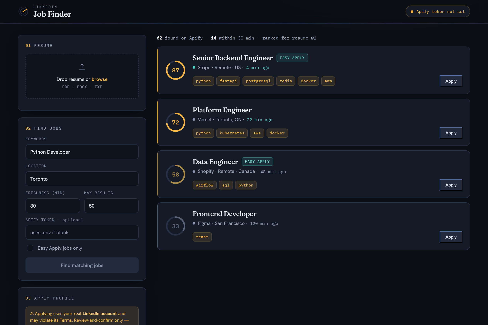

<div align="center">

# LinkedIn Job Finder

**Upload your resume → discover fresh LinkedIn jobs → ranked by fit → review-and-confirm apply.**

[](https://www.python.org/)
[](https://fastapi.tiangolo.com/)
[](https://playwright.dev/)
[](LICENSE)

</div>



---

## What it is

A personal job-hunting dashboard that turns your resume into a **live, ranked feed of fresh opportunities**. Instead of scrolling LinkedIn, you:

1. Upload a resume.
2. It pulls recently-posted jobs from LinkedIn via **Apify** (Apify does the scraping on its own infrastructure — your account is never used for discovery).
3. Each job is **ranked by semantic fit** to your resume (local embeddings + skill boost).
4. For "Easy Apply" jobs, an optional **review-and-confirm** flow pre-fills the application and hands off to you for the final click.

The single design idea: **be early and be relevant** — see the right job within minutes of it being posted.

---

## How it works

```
[Resume PDF/DOCX/TXT]
        │  POST /api/resume/upload
        ▼
┌─────────────────────────┐
│ Resume parser           │  → raw text + skill extraction
└─────────────────────────┘
        │
[search prefs]  POST /api/search
        ▼
┌─────────────────────────┐
│ Apify discovery         │  → LinkedIn Jobs actor (Apify infra)
│ + ≤30-min freshness     │  → postedAt timestamp filter
└─────────────────────────┘
        ▼
┌─────────────────────────┐
│ Embeddings matcher      │  → cosine similarity + skill boost → 0–100
└─────────────────────────┘
        ▼
┌─────────────────────────┐
│ Dashboard (ranked feed) │  → fit-score rings, freshness, Easy-Apply
└─────────────────────────┘
        ▼  (optional, opt-in)
┌─────────────────────────┐
│ Review-and-confirm apply│  → Playwright fills Easy Apply, YOU submit
└─────────────────────────┘
```

---

## Features

- **Resume parsing** — PDF, DOCX, TXT → text + automatic skill extraction.
- **Apify job discovery** — fresh LinkedIn jobs without touching your account.
- **Freshness filter** — keep only jobs posted within N minutes (default 30).
- **Semantic ranking** — `sentence-transformers` embeddings score every job 0–100 against your resume, with a skill-overlap boost.
- **Premium dashboard** — bespoke dark "opportunity console": fit-score rings, pulsing freshness dots, Easy-Apply badges, detail drawer, CSV/JSON export.
- **Review-and-confirm apply** — Playwright fills the Easy-Apply form; you review and click Submit. The bot never submits on your behalf.
- **REST API** — FastAPI backend with interactive docs at `/docs`.

---

## Tech stack

| Layer | Technology |
|---|---|
| Backend | Python 3.12, **FastAPI**, SQLAlchemy + SQLite, Pydantic v2 |
| Discovery | **Apify** (LinkedIn Jobs actor) via `httpx` |
| Matching | **sentence-transformers** (`all-MiniLM-L6-v2`) + NumPy |
| Resume parsing | `pdfplumber`, `python-docx` |
| Apply automation | **Playwright** (Chromium) |
| Frontend | Single-page app, vanilla JS, bespoke CSS, Google Fonts (Fraunces / Hanken Grotesk / IBM Plex Mono) |

---

## Project structure

```
linkedin-job-finder/
├── README.md
├── LICENSE
├── .gitignore
├── docs/
│   └── dashboard.png
├── backend/
│   ├── app/
│   │   ├── main.py              # FastAPI app + static frontend serving
│   │   ├── config.py            # settings from .env
│   │   ├── database.py          # SQLAlchemy engine + session
│   │   ├── models.py            # Resume, Job, Match
│   │   ├── schemas.py           # Pydantic request/response models
│   │   ├── routers/             # resume, search, jobs, apply
│   │   └── services/
│   │       ├── resume_parser.py # PDF/DOCX/TXT → text + skills
│   │       ├── apify_client.py  # Apify run + normalization + freshness
│   │       ├── matcher.py       # embeddings + cosine similarity
│   │       ├── applier.py       # Easy-Apply engine (review-and-confirm)
│   │       └── humanize.py      # human-like typing/clicks/delays
│   ├── tests/test_logic.py      # unit tests (run with zero extra deps)
│   ├── requirements.txt
│   ├── .env.example
│   └── sample_resume.txt
└── frontend/
    └── index.html               # the dashboard (served by FastAPI at /)
```

---

## Quick start

### Prerequisites
- Python 3.10+
- An **Apify account** + API token (for job discovery) — [get one here](https://console.apify.com/account/integrations). The free tier is enough to try it.

### Install & run

```bash
git clone https://github.com/NadeemAhmad3/linkedin-job-finder.git
cd linkedin-job-finder/backend

python -m venv .venv
.venv\Scripts\activate          # Windows  (source .venv/bin/activate on macOS/Linux)

pip install -r requirements.txt
playwright install chromium     # only needed for the optional apply feature

copy .env.example .env          # then edit .env and add your APIFY_API_TOKEN
```

Start it (one command serves both API and UI):

```bash
uvicorn app.main:app --reload
```

Open **http://localhost:8000** → upload the sample resume (`backend/sample_resume.txt`), set keywords/location, and click **Find matching jobs**.

Interactive API docs: **http://localhost:8000/docs**

---

## Configuration

All settings live in `backend/.env` (copy from `.env.example`):

| Variable | Default | Purpose |
|---|---|---|
| `APIFY_API_TOKEN` | — | **Required** for job discovery |
| `APIFY_ACTOR_ID` | `bebity/linkedin-jobs-scraper` | Apify actor (field names vary — see `apify_client.py`) |
| `SEARCH_FRESHNESS_MINUTES` | `30` | Keep jobs posted within this window |
| `MATCH_MODEL` | `sentence-transformers/all-MiniLM-L6-v2` | Embedding model |
| `APPLY_EMAIL` / `APPLY_PHONE` / `APPLY_RESUME_PATH` | — | Apply profile defaults (also editable in the UI) |

The first match request downloads the MiniLM model (~90 MB, once).

---

## API reference

| Method | Endpoint | Purpose |
|---|---|---|
| `GET`  | `/api/health` | Status + whether Apify token is set |
| `POST` | `/api/resume/upload` | Upload resume → parse + extract skills |
| `GET`  | `/api/resume/{id}` | Fetch a parsed resume |
| `POST` | `/api/search` | Apify discovery + freshness filter + ranking |
| `GET`  | `/api/jobs?resume_id=` | Stored jobs (with fit score) |
| `GET`  | `/api/jobs/{id}` | Job detail |
| `GET`  | `/api/apply/profile` | Read apply profile |
| `PUT`  | `/api/apply/profile` | Save apply profile |
| `POST` | `/api/apply/start` | Start a review-and-confirm Easy-Apply session |
| `GET`  | `/api/apply/status?session_id=` | Poll apply status |
| `POST` | `/api/apply/cancel?session_id=` | Cancel an apply session |

### Example — search

```bash
curl -X POST http://localhost:8000/api/search \
  -H "Content-Type: application/json" \
  -d '{"resume_id": 1, "keywords": "Python Developer", "location": "Toronto",
       "freshness_minutes": 30, "easy_apply_only": true, "limit": 50}'
```

---

## How matching works

- **Base score:** cosine similarity between the resume embedding and each job's `title + company + location + description` embedding, scaled to 0–100.
- **Skill boost:** +3 points per matched catalog skill (capped at +12).
- Results are returned sorted by score, descending.
- If the embedding model can't load, it transparently falls back to token-overlap scoring so the API still works.

---

## Apply (Phase 4 — review-and-confirm)

Optional. The bot fills an Easy-Apply form and navigates to the review step, then **stops** — you review in the browser and click Submit yourself. It never submits on your behalf. First run opens a browser for a one-time manual login; the session persists for later runs. Fill your profile in the dashboard's **Apply profile** panel.

Status flow: `launching → needs_login → filling → awaiting_review → submitted` (or `failed` / `cancelled` / `timed_out`). One apply at a time.

---

## Testing

```bash
cd backend
python tests/test_logic.py      # standalone runner, zero extra dependencies
# or
pip install pytest && pytest -q
```

Covers skill extraction, resume parsing, Apify field normalization, date parsing, the freshness filter, the embeddings matcher ranking, and the apply form-brain.

---

## Roadmap

- [ ] WebSocket/SSE streaming for live search + apply progress
- [ ] Multi-job apply queue with per-job delays
- [ ] LLM-based "why this fits" explanations
- [ ] Light theme variant

---

## ⚠ Disclaimer

Scraping and automated applying may violate **LinkedIn's Terms of Service**. This project is for **personal and educational use**. Use a secondary account, keep volume low, and accept the risk. Discovery via Apify happens on Apify's infrastructure and does not use your LinkedIn account; only the optional apply step uses your session. The authors are not responsible for any misuse.

---

## Author

**Nadeem Ahmad**

- GitHub: [@NadeemAhmad3](https://github.com/NadeemAhmad3)
- LinkedIn: [nadeem-ahmad3](https://www.linkedin.com/in/nadeem-ahmad3/)
- Email: [engrnadeem26@gmail.com](mailto:engrnadeem26@gmail.com)

---

## License

Released under the [MIT License](LICENSE).
